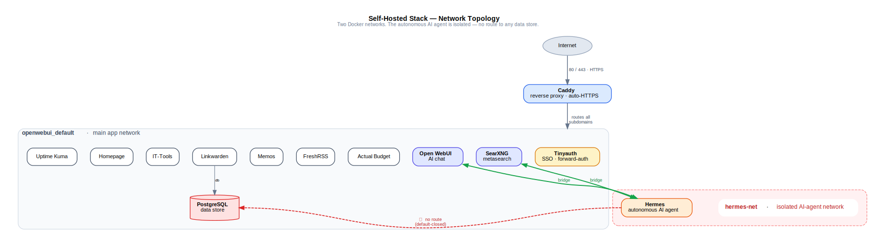

# Self-Hosted Infrastructure Platform

> A hardened, 13-service self-hosted platform on a single Linux VPS — reverse-proxied HTTPS, single sign-on across services, and a **network-isolated autonomous AI agent**, all defined as reproducible Docker Compose configuration.

`Linux` · `Docker` · `Docker Compose` · `Caddy` · `reverse proxy` · `HTTPS / Let's Encrypt` · `DNS` · `network isolation` · `SSH hardening` · `ufw` · `fail2ban` · `forward-auth SSO` · `PostgreSQL` · `DigitalOcean / VPS` · `infrastructure-as-config` · `secrets management` · `LLM / AI-agent deployment` · `cron`

*This is a personal, self-directed project — something I designed, built, and operate to learn infrastructure and security hands-on. I represent the level honestly throughout: foundational / early-career, "built and operate," not years of production experience.*

<!--
  REDACTION NOTE (for me, not the reader): this repo is public. The real domain,
  server IP, and all secrets must never appear here. Examples below use the
  `yourdomain.com` placeholder, matching docker-compose.example.yml / Caddyfile.example.
-->

---

## What this is

This repository documents a self-hosted application platform I designed, built, and run on a single Ubuntu cloud server (a VPS). It runs **thirteen containerized services behind one reverse proxy** with automatic HTTPS and single sign-on — a personal AI chat interface, budgeting, RSS, notes, bookmarks, uptime monitoring, a dashboard, and developer utilities — plus a **self-hosted autonomous AI agent that is deliberately isolated on its own network.**

The whole system is captured as Docker Compose configuration that survives reboots and rebuilds: tear it down, bring it back, and it comes up the same. The part I'm proudest of isn't the list of apps — it's the **security architecture**: defense-in-depth on the host, and a default-closed network design that contains what the AI agent can reach.

> This repo publishes only **sanitized `.example` configs.** The real domain, the server IP, and every secret were redacted before anything was committed — see [`.gitignore`](.gitignore), which physically blocks the real files from ever being staged.

---

## Architecture



**A single public entrypoint.** The Internet only ever talks to **Caddy**, on ports 80 and 443. Caddy terminates TLS — certificates issued and renewed automatically via Let's Encrypt — and reverse-proxies each subdomain (`chat.yourdomain.com`, `budget.yourdomain.com`, …) to the right internal container. Nothing else is exposed to the public internet.

**One login for everything.** **Tinyauth** provides single sign-on using Caddy's `forward_auth`: a small reusable snippet sends each gated request to Tinyauth first, and one login sets a cookie that covers every gated subdomain. Open WebUI keeps its own login *by design*, so the AI chat can be used without handing out access to the rest of the stack.

**Two networks, one boundary.** The stack runs on two Docker networks. The main network carries the app fleet. A second, isolated network — **`hermes-net`** — exists solely for the autonomous AI agent. Open WebUI and SearXNG sit on *both* networks so the agent can chat and run web searches, but **the agent itself has no network path to the database, the notes app, the budget data, or anything else.** The posture is **default-closed**: granting the agent a new service is a deliberate, one-service-at-a-time decision (`docker network connect hermes-net <service>`), and the database is intentionally never on that list.

The agent (Hermes, by Nous Research) has persistent memory and tool use, runs scheduled (cron) jobs — e.g. a daily briefing pushed to my phone through a **locked-down Telegram bot** (allow-listed to a single user) — and is reachable only from inside the stack. Its image is **pinned by digest**, so updates are deliberate rather than silently moving with a `:latest` tag.

---

## Services

| Service | Role | Access |
|---|---|---|
| **Caddy** | Reverse proxy + automatic HTTPS | Public — the only public entrypoint (80/443) |
| **Tinyauth** | Single sign-on (forward-auth) | The gate in front of most apps |
| **Open WebUI** | Self-hosted AI chat (connects to the agent) | Own login — *intentionally not* behind SSO |
| **SearXNG** | Private metasearch | Internal only |
| **Actual Budget** | Personal budgeting | SSO-gated |
| **Uptime Kuma** | Uptime monitoring + alerts | SSO-gated |
| **Homepage** | Service dashboard (apex domain) | SSO-gated |
| **FreshRSS** | RSS reader | SSO-gated |
| **Memos** | Quick notes | SSO-gated |
| **IT-Tools** | Developer utilities | SSO-gated |
| **Linkwarden** | Bookmarks + page archiving | SSO-gated |
| **PostgreSQL** | Database for Linkwarden | Internal only |
| **Hermes** | Autonomous AI agent (Nous Research) | Internal only — no public URL, isolated network |

---

## Security highlights

Security is the part of this project I cared most about, and it's where the more interesting engineering decisions live. The full reasoning — the *why* behind each choice — is written up separately in `docs/security.md` (the next piece of this writeup). The headlines:

- **Network isolation as the real boundary.** The agent was, at first, on the shared app network — which gave it a path to the database *port*. I caught it, reasoned through the actual blast radius (the DB password was never readable by the agent; only the port was reachable), and re-architected to a dedicated, default-closed network. The lesson I keep coming back to: an **infrastructure boundary you can reason about beats a soft, in-app "are you sure?" gate** that a determined agent can route around.
- **Key-only SSH.** `ed25519` keys only; password authentication and root-password login disabled. I set up and *tested* a recovery path (the provider's recovery console) **before** flipping the switch, so a mistake couldn't lock me out.
- **Host firewall + intrusion mitigation.** `ufw` in default-deny with explicit allow rules, `fail2ban` auto-banning brute-force attempts, and a cleanup pass that found and removed stray open ports.
- **Secrets isolation.** Credentials are kept out of the version-controlled config and live in a runtime env file inside a Docker volume. Part of the work was simply reasoning clearly about *where each secret lives and who — or what — can read it.*

---

## What I built and learned

This was self-directed: I picked the tools, made the mistakes, and fixed them. A few takeaways beyond the specific technologies:

- **Validate before you apply.** Backups before edits, `docker compose config` to render the stack before bringing it up, and staged changes with checkpoints rather than big-bang edits.
- **Read the logs, don't guess.** Most of the real debugging — a reboot that left a service down, an SSH key that wouldn't authenticate, a config merge conflict — came down to reproducing the issue, reading the actual error, and *verifying* the fix rather than assuming it worked.
- **Healthy skepticism.** I questioned changes before making them and sought a second opinion on a security finding rather than trusting the first answer. That instinct is what caught the agent-network issue above.

**Honest framing:** these are foundational, hands-on skills from a real project I build and operate — not years of production experience. I'd put my level at junior / early-career, and the project as a genuine demonstration of being able to learn independently and ship a working, secured system.

---

## Built with

- **Infrastructure:** DigitalOcean (Ubuntu 22.04 VPS), Docker, Docker Compose
- **Networking & proxy:** Caddy, Let's Encrypt / automatic TLS, DNS, Docker bridge networks, network segmentation
- **Security:** OpenSSH (key-only, `ed25519`), `ufw`, `fail2ban`, Tinyauth (forward-auth SSO), runtime secrets isolation
- **Data:** PostgreSQL
- **AI / LLM:** Open WebUI, Hermes agent (Nous Research), OpenRouter API (with cost caps), cron-scheduled tasks, Telegram gateway

---

## What's in this repo

```text
homelab-infra/
├── README.md                     ← you are here
├── .gitignore                    blocks the real config from ever being committed
├── docker-compose.example.yml    the full stack, sanitized (secrets / domain / IP removed)
├── Caddyfile.example             reverse-proxy + SSO config, sanitized
└── docs/
    ├── security.md               the security reasoning, in depth          (in progress)
    └── architecture-diagram.*    visual of the topology                    (in progress)
```

The two `.example` files are the proof this is real, working infrastructure-as-config — read as actual deployable configuration, just with every secret, the real domain, and the server IP swapped for descriptive placeholders. They are **not** meant to be cloned and run as-is; they're here to be *read*.

---

<sub>Personal, self-directed project. Real credentials and host details are intentionally omitted. Experience level is represented honestly — "built and operate this stack" is both true and the point.</sub>
